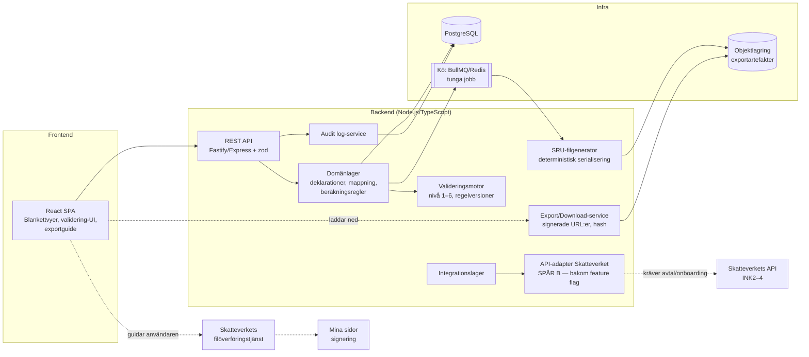
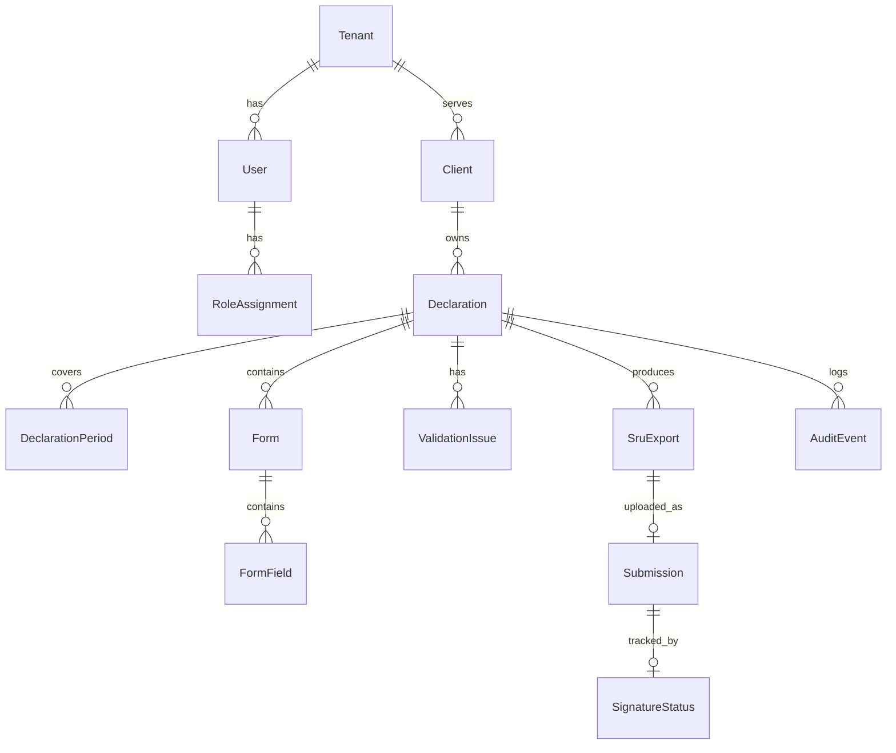
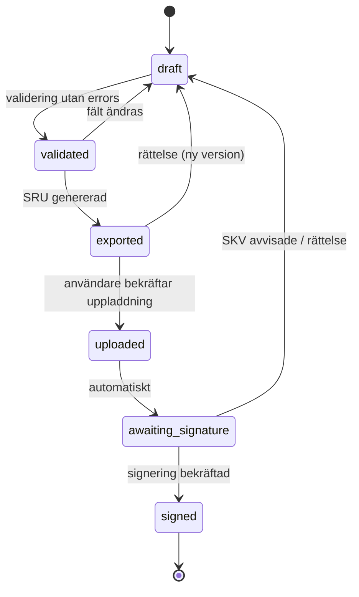
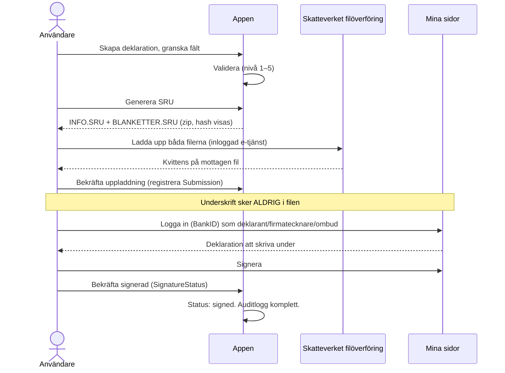

# Deklarationsmodul — Teknisk produktspecifikation

**Version:** 1.0 (utkast för implementation)
**Datum:** 2026-07-08
**Status:** Design — kräver verifiering mot Skatteverkets officiella tekniska beskrivningar innan produktion
**Målgrupp:** Utvecklingsteam, produktägare, säkerhetsgranskare

---

## Executive summary

Denna specifikation beskriver en deklarationsmodul som tar användaren hela vägen från bokförd affärsdata till inlämnad och signerad inkomstdeklaration hos Skatteverket. Modulen stödjer tre inlämningsvägar:

- **Spår 0 — Manuell deklaration:** appen presenterar färdigberäknade blankettvärden med fältkoder så att användaren kan mata in dem för hand i Skatteverkets e-tjänst. Detta finns delvis redan idag (NE-bilagan i Skatt-fliken) och byggs ut till komplett blankettvy.
- **Spår A — SRU-filöverföring (MVP):** appen mappar bokföringsdata till blankettfält, genererar `INFO.SRU` och `BLANKETTER.SRU`, validerar filerna, låter användaren ladda ned dem och guidar vidare till Skatteverkets filöverföringstjänst. Signering sker aldrig i filen — den görs efteråt på Mina sidor av kund, behörig firmatecknare eller deklarationsombud.
- **Spår B — API-integration (framtid):** integration mot Skatteverkets API-tjänster för Inkomstdeklaration 2–4: hämta förifyllda uppgifter, lämna underlag till eget utrymme, läsa status och skicka vidare för signering. Kräver särskild anslutning, avtal och teknisk onboarding hos Skatteverket — alla externa API-detaljer i detta dokument är markerade som overifierade.

Nyckelinsikten som styr all design: **SRU-filen är inte bokföringen.** Den är ett mappat deklarationsunderlag — en ögonblicksbild av blankettfält härledda ur bokföringen enligt BAS→SRU-kodmappning plus manuella justeringar. Därför separerar arkitekturen strikt domänlager (bokföring, beräkning) från exportlager (serialisering, filer), och varje export är en oföränderlig, hashad artefakt med full spårbarhet.

Rekommenderad stack: TypeScript/Node.js, PostgreSQL, kögestyrd filgenerering, React-frontend. För den befintliga lokala appen (IndexedDB, ingen backend) kan Spår 0 och Spår A:s kärna (mappning + SRU-serialisering + validering) implementeras klient-side med samma domänmodell — serialiseringen är ren textgenerering utan serverberoende. Plattformsarkitekturen i detta dokument beskriver målbilden för fleranvändar-/byråscenariot.

---

## 1. Produktöversikt

### 1.1 Problemet

En företagare som sköter sin bokföring själv möter ett glapp vid deklarationstid: bokföringen finns i ett system, men Skatteverket vill ha blankettdata (INK1/INK2 med bilagor) i ett specifikt inlämningsformat. Idag löses det med manuell överföring siffra för siffra — långsamt och felbenäget — eller med dyra byråsystem.

### 1.2 Lösningen

Deklarationsmodulen:

1. **Samlar in** deklarationsdata från bokföringen (huvudbok/transaktioner) och från manuell registrering.
2. **Mappar** affärsdata till blankettdata via BAS→SRU-kodtabeller per beskattningsår.
3. **Validerar** i sex nivåer (teknisk → pre-submission) med åtgärdbara felmeddelanden.
4. **Genererar** korrekta `INFO.SRU` + `BLANKETTER.SRU` (Spår A) eller visar blankettvärden för manuell inmatning (Spår 0).
5. **Guidar** användaren genom uppladdning på Skatteverkets filöverföringstjänst och signering på Mina sidor.
6. **Följer upp** status: exporterad → uppladdad → väntar på signering → signerad.

### 1.3 Formatens roller — SIE vs SRU vs API

| Format/Kanal | Roll | Riktning | Innehåll |
|---|---|---|---|
| **SIE (4)** | Bokföringsexport/-import mellan ekonomisystem | System ↔ system | Kontoplan, verifikationer, saldon — själva bokföringen |
| **SRU** | Deklarationsinlämning via fil | System → Skatteverket | Blankettfält (fältkod + värde) — ett *härlett underlag*, inte bokföringen |
| **Skatteverkets API** | Integrationskanal för INK2–4 | System ↔ Skatteverket | Förifyllda uppgifter, inlämning till eget utrymme, status, signeringsflöde |

Relationskedjan från bokföring till blankett:

```
BAS-konto (t.ex. 3000)
   │  summeras per räkenskapsår
   ▼
Saldo per konto/kontointervall
   │  BAS→SRU-kodtabell (per taxeringsår, per blankett)
   ▼
SRU-kod / fältkod (t.ex. 7410 på INK2R)
   │  placeras på blankett
   ▼
Blankettfält på INK2R/INK2S/NE/N-bilagor...
   │  serialiseras
   ▼
#UPPGIFT-rad i BLANKETTER.SRU
```

En SRU-kod är i praktiken en **fältkod på en specifik blankett för ett specifikt år**. BAS-organisationen publicerar årliga kopplingstabeller BAS-konto → SRU-kod. Mappningen är alltså versionsberoende i tre dimensioner: kontoplan, blankettversion och beskattningsår.

### 1.4 Vad som omfattas av filöverföring

Filöverföring med SRU-filer används bland annat för **hela Inkomstdeklaration 1 och 2 samt bilagor till Inkomstdeklaration 1–4** (NE, NEA, N3A/N3B, N7, N8, K-blanketter m.fl. — exakt blankettlista per år ska verifieras mot Skatteverkets aktuella förteckning). Deklarationen **skrivs inte under i filen** — underskrift sker på Mina sidor av kunden, behörig firmatecknare eller deklarationsombud efter uppladdning.

---

## 2. Omfattning och avgränsningar

### 2.1 I scope (MVP = Spår 0 + Spår A)

- Blanketter: **NE-bilagan** (enskild firma, redan delvis implementerad), **INK1-huvudfält relevanta för näringsverksamhet**, därefter **INK2 + INK2R + INK2S** (aktiebolag).
- BAS→SRU-mappning med årsversionerade tabeller, manuella justeringar per fält.
- Generering, validering och nedladdning av `INFO.SRU` + `BLANKETTER.SRU`.
- Guidat inlämningsflöde (checklista, länkar, statusuppföljning som användaren själv bekräftar).
- Auditlogg över alla ändringar och exporter.

### 2.2 Utanför scope (MVP)

- **Ingen signering i appen** — sker alltid på Mina sidor.
- **Ingen direktuppladdning** till Skatteverket i Spår A (användaren laddar upp manuellt i filöverföringstjänsten).
- Moms-/arbetsgivardeklarationer (annat inlämningsflöde, eget framtida spår).
- K10 och komplexa delägarblanketter i första leverans (kräver egen regelmotor).
- Spår B implementeras inte i MVP — designas som adapter så det kan aktiveras senare.

### 2.3 Antaganden

| # | Antagande | Konsekvens om fel |
|---|---|---|
| A1 | SRU-formatets radstruktur enligt avsnitt 7 gäller för aktuellt beskattningsår | Serialiserare måste uppdateras; golden files fångar skillnad |
| A2 | Teckenkodning för SRU-filer är ISO 8859-1 *(måste verifieras mot SKV:s tekniska beskrivning)* | Encoder-byte i en modul |
| A3 | `BLANKETTER.SRU` max 5 MB; filerna får inte döpas om | Validering + UX-copy redan byggd för detta |
| A4 | Skatteverket tillhandahåller testtjänst för SRU-filvalidering *(verifieras)* | Manuell QA-plan justeras |
| A5 | Byråscenario (multi-tenant) behövs först efter MVP | Datamodellen har Tenant från dag 1, UI:t exponerar det senare |

---

## 3. Aktörsmodell och behörigheter

| Roll | Beskrivning | Rättigheter i appen | Begränsningar | Var sker signering? |
|---|---|---|---|---|
| **Företagare/Deklarant** | Ägare av deklarationen (fysisk/juridisk person) | Full CRUD på egen deklaration, generera/ladda ned SRU, markera inlämnad | Ser endast egna deklarationer | Mina sidor (BankID) |
| **Redovisningskonsult** | Upprättar deklarationer åt kunder | CRUD på tilldelade kunders deklarationer, generera/exportera | Kan inte markera "signerad" utan kundbekräftelse; ingen åtkomst utan RoleAssignment | Signerar aldrig — förbereder |
| **Byråadmin** | Administrerar byråns kunder och användare | Hantera användare, kundtilldelning, se all byrådata, auditlogg | Kan inte redigera deklarationsinnehåll utan konsultroll på kunden | — |
| **Behörig firmatecknare** | Får underteckna för juridisk person | Läsa, godkänna internt ("redo för inlämning") | Registreras med personnummer för spårbarhet; appen verifierar INTE firmateckningsrätt — det gör Skatteverket vid signering | Mina sidor |
| **Deklarationsombud** | Av Skatteverket godkänt ombud | Som firmatecknare i appen | Ombudsbehörigheten administreras hos Skatteverket, inte i appen; appen lagrar endast uppgift om vem som förväntas signera | Mina sidor |
| **Systemadministratör** | Drift/support av plattformen | Teknisk administration, läsa auditlogg | **Ingen läsrätt till deklarationsinnehåll** i normalfall (break-glass med loggning) | — |

**Central princip:** appen hanterar *förberedelse och export*. Behörighet att faktiskt signera prövas av Skatteverket vid inloggning på Mina sidor — appen lagrar bara *vem som förväntas signera* (SignatureStatus) för att kunna guida och påminna. Detta gör att appen aldrig behöver bära juridiskt ansvar för firmateckningskontroll.

Behörighetsmodell: RBAC via `RoleAssignment (userId, tenantId, clientId?, role)`. All åtkomstkontroll sker i domänlagret per operation (se API-spec, kolumn Auth).

---

## 4. Systemarkitektur

### 4.1 Översikt



### 4.2 Designprinciper

1. **Domän ≠ Export.** Domänlagret känner till konton, belopp och blankettfält. Exportlagret känner till radformat, encoding och filnamn. Ingen SRU-syntax läcker in i domänmodellen.
2. **Deterministisk export.** Samma deklarationsversion → byte-identisk fil (stabil sortering, ingen klocka i innehållet utom `#SKAPAD` som fryses vid exporttillfället och lagras). Möjliggör golden-file-tester och hash-verifiering.
3. **Oföränderliga artefakter.** En genererad export ändras aldrig — rättelse skapar ny export med ny version och nytt `#SKAPAD`. Filerna döps aldrig om (`INFO.SRU`/`BLANKETTER.SRU` ligger i en zip eller mapp per export).
4. **Kö för tunga jobb.** Filgenerering, validering av stora byrå-batchar och framtida API-anrop körs asynkront (BullMQ) med idempotencynycklar.
5. **Regelverk som data.** Mappningstabeller och valideringsregler är versionerade datastrukturer (per beskattningsår), inte hårdkodade if-satser.

### 4.3 Anpassning till befintlig lokal app

Den nuvarande appen är lokal (IndexedDB, ingen backend). Kärnan i Spår 0/A — mappningstabeller, beräkning, validering, SRU-serialisering — är **ren TypeScript utan serverberoenden** och placeras i ett delbart paket (`lib/sru/`). MVP kan därmed levereras i den lokala appen: generering och nedladdning sker i webbläsaren (Blob-download, encoding via `TextEncoder`/manuell Latin-1-mappning). Plattformsdelarna (tenant, kö, PostgreSQL, auditlogg på server) aktiveras när byråscenariot byggs. Datamodellen nedan är skriven så att entiteterna fungerar i båda världarna (Dexie-tabeller ↔ PostgreSQL-tabeller).

---

## 5. Datamodell

### 5.1 Entitetsöversikt



### 5.2 Entiteter

| Entitet | Beskrivning | Kärnattribut | Relationer |
|---|---|---|---|
| **Tenant** | Byrå eller enskilt företag (multi-tenant-rot) | id, namn, orgnr, plan | → User, Client |
| **Client/Deklarant** | Den skattskyldige (fysisk/juridisk person) | id, tenantId, namn, orgnr/personnr, typ (EF/AB/HB…), adress | → Declaration |
| **User** | Inloggad användare | id, tenantId, e-post, namn | → RoleAssignment |
| **RoleAssignment** | Koppling användare↔roll↔(kund) | userId, tenantId, clientId?, role | — |
| **Declaration** | En deklaration för ett beskattningsår | id, clientId, taxYear, type (INK1/INK2), status, version, regelverksversion | → Form, SruExport |
| **DeclarationPeriod** | Räkenskapsperiod(er) som ingår | declarationId, startDate, endDate (brutet räkenskapsår, förlängt/förkortat) | — |
| **Form** | En blankett i deklarationen | id, declarationId, formCode (t.ex. `INK2R`), formVersion (t.ex. `-2026P1`), sortOrder | → FormField |
| **FormField** | Ett fältvärde på en blankett | formId, fieldCode (SRU-kod), value, source (`auto`/`manual`/`adjusted`), autoValue, note | — |
| **ValidationIssue** | Ett valideringsutfall | declarationId, level (`error`/`warning`/`info`), code, message, formCode?, fieldCode?, resolvedAt? | — |
| **SruExport** | En genererad exportartefakt | id, declarationId, declarationVersion, createdAt (=`#SKAPAD`), infoSha256, blanketterSha256, sizeBytes, storageRef, status | → Submission |
| **Submission** | Användarens (bekräftade) uppladdning hos SKV | id, sruExportId, uploadedAt, uploadedBy, skvReference?, channel (`file`/`api`) | → SignatureStatus |
| **SignatureStatus** | Signeringsläge | submissionId, expectedSigner (namn+personnr), signedAt?, confirmedBy, method (`minasidor`) | — |
| **AuditEvent** | Spårbarhetslogg | id, tenantId, actorUserId, entity, entityId, action, timestamp, diffSummary (utan känsliga värden) | — |

### 5.3 Statusmaskin — Declaration



Regler: en `Declaration` i `exported`+ är låst för redigering — ändring kräver explicit "Skapa rättelse" som bumpar `version`, sätter status `draft` och behåller historiken. `SruExport`-rader raderas aldrig.

### 5.4 JSON-exempel

```json
{
  "declaration": {
    "id": "dec_01J9ZK3M",
    "clientId": "cli_8842",
    "taxYear": 2026,
    "type": "INK2",
    "status": "validated",
    "version": 3,
    "ruleSetVersion": "2026.1",
    "periods": [{ "start": "2025-01-01", "end": "2025-12-31" }],
    "forms": [
      {
        "formCode": "INK2R",
        "formVersion": "INK2R-2026P1",
        "fields": [
          { "fieldCode": "7410", "value": "1250000", "source": "auto",
            "autoValue": "1250000", "note": null },
          { "fieldCode": "7411", "value": "48000", "source": "adjusted",
            "autoValue": "45200", "note": "Justerat för ej avdragsgill representation" }
        ]
      }
    ]
  }
}
```

```json
{
  "sruExport": {
    "id": "exp_01JA0X",
    "declarationId": "dec_01J9ZK3M",
    "declarationVersion": 3,
    "createdAt": "2026-07-08T14:32:11+02:00",
    "files": [
      { "name": "INFO.SRU",       "sha256": "9f2c…", "sizeBytes": 412 },
      { "name": "BLANKETTER.SRU", "sha256": "b71e…", "sizeBytes": 18734 }
    ],
    "status": "ready",
    "maxSizeCheck": { "limitBytes": 5242880, "ok": true }
  }
}
```

---

## 6. Intern API-design

REST, JSON, versionerad under `/api/v1`. Autentisering: sessions-token (webapp) alt. PAT för integrationer. Auktorisering: RBAC-kontroll per operation mot RoleAssignment. Alla muterande anrop stödjer `Idempotency-Key`-header. I den lokala appen ersätts transportlagret av direkta funktionsanrop mot samma domänfunktioner — API-kontraktet nedan är därmed även modulens interna funktionssignaturer.

| Operation | Metod & path | Syfte | Auth (minst) | Idempotens/Konkurrens |
|---|---|---|---|---|
| Skapa deklaration | `POST /declarations` | Ny deklaration för kund+år | Konsult på kund | Idempotency-Key; unik (clientId, taxYear, type) → `409` |
| Hämta deklaration | `GET /declarations/:id` | Full deklaration inkl. blanketter | Läsroll på kund | — |
| Uppdatera blankettfält | `PATCH /declarations/:id/forms/:formCode` | Sätta/justera fältvärden | Konsult | `If-Match: <version>` → `412` vid konflikt |
| Validera | `POST /declarations/:id/validate` | Kör nivå 1–5, returnera issues | Läsroll | Ren funktion av innehåll — säkert att upprepa |
| Generera SRU | `POST /declarations/:id/exports` | Skapa exportjobb (kö) | Konsult | Idempotency-Key; låser deklarationsversion |
| Hämta exportstatus | `GET /exports/:exportId` | Jobbstatus + filmetadata + hash | Läsroll | — |
| Ladda ned filer | `GET /exports/:exportId/download` | Zip med INFO.SRU + BLANKETTER.SRU (signerad URL, TTL) | Läsroll | Loggas i audit |
| Markera redo för inlämning | `POST /declarations/:id/ready` | Internt godkännande (firmatecknare) | Firmatecknare/deklarant | Statusövergång valideras |
| Registrera uppladdning | `POST /exports/:exportId/submission` | Användaren bekräftar uppladdning hos SKV | Deklarant/konsult | En submission per export → `409` |
| Spara signeringsstatus | `PUT /submissions/:id/signature` | Bekräfta signerad på Mina sidor | Deklarant/firmatecknare | Senaste skrivning vinner; allt auditloggas |
| Hämta auditlogg | `GET /declarations/:id/audit` | Spårbarhet | Byråadmin/deklarant | Paginerad |

### 6.1 Exempel — generera SRU

```http
POST /api/v1/declarations/dec_01J9ZK3M/exports
Idempotency-Key: 7c9e6679-7425-40de-944b-e07fc1f90ae7
Content-Type: application/json

{ "declarationVersion": 3 }
```

```json
// 202 Accepted
{
  "exportId": "exp_01JA0X",
  "status": "queued",
  "statusUrl": "/api/v1/exports/exp_01JA0X"
}
```

Felkoder:

| HTTP | Kod | Betydelse |
|---|---|---|
| 400 | `INVALID_STATE` | Deklarationen är inte `validated` |
| 409 | `VERSION_CONFLICT` | `declarationVersion` matchar inte aktuell version |
| 409 | `DUPLICATE_REQUEST` | Samma Idempotency-Key med annan payload |
| 422 | `VALIDATION_ERRORS` | Blockerande valideringsfel finns (lista bifogas) |
| 403 | `FORBIDDEN_ROLE` | Saknar konsult-/deklarantroll på kunden |

### 6.2 Exempel — validering

```http
POST /api/v1/declarations/dec_01J9ZK3M/validate
```

```json
// 200 OK
{
  "status": "invalid",
  "issues": [
    {
      "level": "error", "code": "SRU-ORGNR-01",
      "formCode": "INK2R", "fieldCode": null,
      "message": "Organisationsnumret 556000-000 har fel format (förväntat 10 siffror med giltig kontrollsiffra).",
      "supportHint": "Kontrollera Client.orgnr; Luhn-kontroll misslyckades."
    },
    {
      "level": "warning", "code": "MAP-UNMAPPED-3900",
      "formCode": "INK2R", "fieldCode": null,
      "message": "Konto 3990 'Övriga intäkter' saknar SRU-mappning för 2026 och ingår inte i något fält.",
      "supportHint": "Lägg till mappning i regelverk 2026.1 eller justera fältet manuellt."
    }
  ]
}
```

---

## 7. SRU-specifikation (implementeringsspec)

> ⚠️ **Hela detta avsnitt ska verifieras mot Skatteverkets officiella tekniska beskrivning för aktuellt beskattningsår (SKV:s "Teknisk beskrivning – SRU-filer", tidigare SKV 269) innan produktion.** Struktur och taggar nedan följer formatets etablerade uppbyggnad; exakt fältordning, obligatoriskhet och tillåtna värden per år måste stämmas av.

### 7.1 Varför två filer?

Filöverföringen består av ett *paket* om två filer med **fasta, ej omdöpbara filnamn**:

- **`INFO.SRU`** — försättsblad/medieleverans: identifierar programvaran som skapat filerna och uppgiftslämnaren (kontaktuppgifter). Motsvarar det gamla följebrevet till diskettleveranser.
- **`BLANKETTER.SRU`** — själva nyttolasten: en eller flera blanketter med fältkoder och värden. **Max 5 MB.**

Filerna hör ihop som ett par och laddas upp tillsammans. Eftersom `INFO.SRU` refererar till blankettfilen får ingen av dem döpas om efter generering.

### 7.2 Radformat

- Textfiler, en post per rad. Varje rad börjar med `#TAGG`, följt av mellanslagsseparerade värden.
- Radbrytning: CRLF *(verifieras — generatorn har detta som konfigurerbar konstant)*.
- Teckenkodning: ISO 8859-1 *(verifieras; å/ä/ö måste testas mot SKV:s testtjänst)*.
- Avslutande `#FIL_SLUT` krävs i filen.

### 7.3 INFO.SRU — struktur

```
#DATABESKRIVNING_START
#PRODUKT SRU
#SKAPAD 20260708 143211
#PROGRAM LokalBokforing 2.0
#FILNAMN BLANKETTER.SRU
#DATABESKRIVNING_SLUT
#MEDIELEV_START
#ORGNR 165560000167
#NAMN Exempelbolaget AB
#ADRESS BOX 159
#POSTNR 12345
#POSTORT SKATTSTAD
#KONTAKT KARL KARLSSON
#EMAIL kk@exempelbolaget.se
#TELEFON 08-2121212
#MEDIELEV_SLUT
#FIL_SLUT
```

| Tagg | Innebörd | Obligatorisk |
|---|---|---|
| `#DATABESKRIVNING_START/_SLUT` | Ramar in produkt-/filbeskrivningen | Ja |
| `#PRODUKT` | Alltid `SRU` | Ja |
| `#SKAPAD` | Datum + klockslag när filen skapades (`ÅÅÅÅMMDD TTMMSS`) | Ja *(format verifieras)* |
| `#PROGRAM` | Programnamn + version som genererat filen | Ja |
| `#FILNAMN` | Namnet på blankettfilen: `BLANKETTER.SRU` | Ja |
| `#MEDIELEV_START/_SLUT` | Ramar in uppgiftslämnarens kontaktuppgifter | Ja |
| `#ORGNR` | Uppgiftslämnarens org-/personnummer (12 siffror med sekelsiffror) | Ja |
| `#NAMN`, `#ADRESS`, `#POSTNR`, `#POSTORT`, `#KONTAKT`, `#EMAIL`, `#TELEFON` | Kontaktuppgifter | Namn ja; övriga *(verifieras)* |
| `#FIL_SLUT` | Filslutmarkör | Ja |

### 7.4 BLANKETTER.SRU — struktur

En fil innehåller 1–N blankettblock (flera kunder/blanketter kan samlas i en fil, t.ex. för byråer):

```
#BLANKETT INK2R-2026P1
#IDENTITET 165560000167 20260708 143211
#NAMN Exempelbolaget AB
#UPPGIFT 7410 1250000
#UPPGIFT 7411 48000
#UPPGIFT 7510 -35000
#BLANKETTSLUT
#BLANKETT INK2S-2026P1
#IDENTITET 165560000167 20260708 143211
#UPPGIFT 8686 125000
#BLANKETTSLUT
#FIL_SLUT
```

| Tagg | Innebörd |
|---|---|
| `#BLANKETT` | Blankettkod inkl. årsversion, t.ex. `INK2R-2026P1`, `NE-2026P1` *(exakta koder per år verifieras)* |
| `#IDENTITET` | Deklarantens org-/personnummer (12 siffror) + datum + klockslag |
| `#NAMN` | Deklarantens namn *(obligatoriskhet verifieras)* |
| `#UPPGIFT` | `fältkod` + `värde` — en rad per ifyllt fält |
| `#BLANKETTSLUT` | Avslutar blankettblocket |
| `#FIL_SLUT` | Avslutar filen (exakt en gång, sist) |

### 7.5 Intern modell före serialisering

```typescript
interface SruPackage {
  createdAt: FrozenTimestamp;     // fryses vid export, återanvänds i alla #SKAPAD/#IDENTITET
  program: { name: string; version: string };
  sender: SruSender;              // → INFO.SRU MEDIELEV
  blanketter: SruBlankett[];
}
interface SruBlankett {
  formCode: string;               // "INK2R-2026P1"
  identity: { idNumber12: string; name?: string };
  uppgifter: { fieldCode: string; value: string }[];  // redan formaterade värden
}
```

Serialiseraren är en ren funktion `serialize(pkg): { info: Uint8Array; blanketter: Uint8Array }` — ingen IO, ingen klocka, ingen slump. All formatering (belopp, datum, teckenuppsättning) sker i mappningslagret *innan* serialisering.

### 7.6 Exportregler

1. Filnamn exakt `INFO.SRU` och `BLANKETTER.SRU` — aldrig omdöpta, levereras i zip `sru-export-{deklarationsid}-v{version}.zip` för nedladdning (zipnamnet är fritt, filerna i den inte).
2. `BLANKETTER.SRU` > 5 MB ⇒ exporten avbryts med blockerande fel och förslag om uppdelning i flera exporter.
3. Otillåtna tecken för encodingen ⇒ blockerande valideringsfel med fält-pekare (ingen tyst transliterering).
4. SHA-256 för båda filerna lagras i `SruExport` — stöd för verifiering och regressionstest.
5. Blankettblockens ordning är deterministisk: sorterade på (formCode, identitet).

---

## 8. Mappning och affärsregler

### 8.1 Mappningskedja

```
Transaktioner ──► Saldon per BAS-konto ──► [MappingRuleSet år X] ──► Fältvärden (auto)
                                                                        │
                                              Manuell justering ───────┤ (source: adjusted/manual)
                                                                        ▼
                                                                  FormField.value
```

`MappingRuleSet` är versionerad data (JSON i repo → DB), t.ex.:

```json
{
  "ruleSetVersion": "2026.1",
  "taxYear": 2026,
  "form": "INK2R",
  "rules": [
    { "fieldCode": "7410", "accounts": [{ "from": 3000, "to": 3799 }], "sign": "credit-positive" },
    { "fieldCode": "7511", "accounts": [{ "from": 5000, "to": 6999 }], "sign": "debit-positive" }
  ]
}
```

### 8.2 Regler

| Område | Regel |
|---|---|
| **Manuella justeringar** | `FormField.source` skiljer `auto`/`adjusted`/`manual`. Justerat fält räknas aldrig om automatiskt — men flaggas med warning om `autoValue` drivit iväg efter ombokning. Justeringar kräver `note`. |
| **Fritext/övriga upplysningar** | Eget fält per blankett där formatet tillåter *(fältkod för övriga upplysningar per blankett verifieras)*; längdvalideras; tecken utanför encoding blockeras. |
| **Avrundning** | Blankettbelopp anges i hela kronor *(verifieras per fält)*. Policy: avrunda **per fält** vid mappning (`Math.round`), aldrig i bokföringen. Kontrollsumme-validering varnar om avrundningsdiffar bryter blankettens interna samband. |
| **Negativa värden** | Tillåts endast där blanketten tillåter det (per-fält-flagga i regelverket); serialiseras med ledande minustecken *(format verifieras)*. Otillåtet negativt värde = blockerande fel med förklaring. |
| **Tomma fält** | `#UPPGIFT`-rad utelämnas helt för tomma/nollfält *(nollhantering per fält verifieras — vissa fält kan kräva explicit 0)*. |
| **Periodhantering** | `DeclarationPeriod` stödjer brutet/förlängt/förkortat räkenskapsår; mappningen summerar transaktioner i periodintervallet, inte per kalenderår. |
| **Versionshantering** | Tre versionsaxlar: blankettversion (`INK2R-2026P1`), regelverksversion (`2026.1`), deklarationsversion (rättelser). En deklaration låser sin regelverksversion vid skapande; uppgradering är en explicit, auditloggad operation. |

---

## 9. Valideringsregler

Sex nivåer; körs kumulativt. `error` blockerar export, `warning` kräver aktivt "fortsätt ändå" (loggas), `info` visas.

| Nivå | Namn | Exempel på kontroller |
|---|---|---|
| 1 | **Teknisk** | Encoding-kompatibla tecken, max fältlängder, numeriska fält numeriska |
| 2 | **Syntaktisk** | Org-/personnummer 12 siffror + Luhn, datumformat, blankettkod finns i årets katalog, fältkod finns på blanketten |
| 3 | **Affärsvalidering** | Interna blankettsamband (summafält = delfält), NE: R-radskedjan konsistent, resultat i deklaration ≈ bokfört resultat (diff-varning), omappade konton med saldo |
| 4 | **Roll/behörighet** | Aktören har rätt roll för operationen; firmatecknare/ombud registrerad innan "redo för inlämning" |
| 5 | **Exportvalidering** | Filstorlek ≤ 5 MB, minst en blankett, exakt en `#FIL_SLUT`, deterministisk om-serialisering ger samma hash |
| 6 | **Pre-submission** | Checklista: deklarationen `exported`, rätt beskattningsår, signatär utsedd, användaren bekräftat att uppladdning avser senaste exporten (hash visas) |

**Felmeddelanden — dubbel målgrupp.** Varje issue har `message` (användare, åtgärdbar, svenska) + `supportHint` (teknisk pekare):

> **SRU-SIZE-01** — *Användare:* "Filen BLANKETTER.SRU blev 6,2 MB men får vara högst 5 MB. Dela upp deklarationen i två exporter (t.ex. bilagor separat)." — *Support:* `blanketterBytes=6512340, limit=5242880, blanketter=14, största=NE (2,1 MB)`.

> **MAP-DRIFT-02** — *Användare:* "Fältet 7411 justerades manuellt 3 maj, men bokföringen har ändrats sedan dess (auto-värdet är nu 45 200 kr, ditt värde 48 000 kr). Kontrollera om justeringen fortfarande stämmer." — *Support:* `fieldCode=7411, autoValue@adjust=45200, autoValue@now=45200, value=48000`.

---

## 10. Filgenerering

Pipeline (körs i kö-jobb; i lokal app synkront — datat är litet):

```
1. Lås deklarationsversion (optimistisk låsning)
2. Kör validering nivå 1–5  ──fel──► avbryt, spara issues
3. Bygg SruPackage (frys timestamp)
4. Serialisera → bytes (ren funktion)
5. Kontrollera storlek (≤ 5 MB)
6. SHA-256 per fil, skriv SruExport-rad
7. Lagra artefakt (S3/lokal Blob) — write-once
8. Status: ready → notifiera UI
```

Kravlista:

- **Stabil export:** given (deklarationsversion, regelverksversion, frusen timestamp) är output byte-identisk. Testas med golden files.
- **Ingen omdöpning:** UI:t levererar zip och instruerar användaren att inte byta namn på de uppackade filerna; hjälptext förklarar varför.
- **Rättelse = ny export.** Gamla artefakter behålls (retention, se §11) med full kedja deklarationsversion → export → submission.

---

## 11. Inlämningsflöde

### 11.1 Spår A — sekvens



Appen kan inte läsa status hos Skatteverket i Spår A — status efter nedladdning bygger på användarens bekräftelser. UI:t är tydligt med det ("markera som uppladdad/signerad").

### 11.2 Spår B — API-integration (framtid, kräver avtal)

> ⚠️ **Allt i detta avsnitt kräver verifiering mot Skatteverkets officiella tjänstebeskrivning och tecknat avtal/onboarding.** Inga endpoint-namn eller payloads antas. Nedan beskrivs *vår* adapterdesign.

Skatteverket erbjuder ett separat API-spår för **Inkomstdeklaration 2–4** där programvara kan: hämta förifyllda uppgifter, läsa in deklarationsunderlag till **eget utrymme**, visa deklarationsdata och skicka in för underskrift (signering fortsatt via Mina sidor). Skillnader mot Spår A:

| Aspekt | Spår A (SRU-fil) | Spår B (API) |
|---|---|---|
| Omfattning | INK1–2 helt + bilagor INK1–4 | INK2–4 |
| Anslutning | Ingen — öppen e-tjänst för uppladdning | Avtal, teknisk onboarding, klientcertifikat/auth enligt SKV *(verifieras)* |
| Förifyllda uppgifter | Nej | Ja — kan hämtas in i appen |
| Statusuppföljning | Manuell bekräftelse | Programmatisk status |
| Signering | Mina sidor | Mina sidor (skickas vidare för underskrift) |

Adapterdesign i vår plattform:

```typescript
interface SkvApiAdapter {                        // bakom feature flag; DI-injiceras
  fetchPrefilled(client: ClientRef, taxYear: number): Promise<PrefilledData>;
  submitToEgetUtrymme(pkg: DeclarationPayload): Promise<{ skvReference: string }>;
  getStatus(skvReference: string): Promise<SkvStatus>;
  requestSignatureRouting(skvReference: string): Promise<void>;
}
```

Integrationslagret översätter domänmodell ↔ SKV-format, hanterar retries med idempotens, och lagrar `skvReference` på `Submission` (channel: `api`). Tills avtal finns implementeras en `MockSkvApiAdapter` för att kunna bygga och testa UI-flödet.

---

## 12. Säkerhet och compliance

| Område | Design |
|---|---|
| **Personuppgifter** | Person-/orgnummer, namn, adress, ekonomiska uppgifter = personuppgifter (GDPR). Rättslig grund: avtal/rättslig förpliktelse. PUB-avtal krävs för byråscenario. |
| **Kryptering** | TLS 1.2+ i transit; AES-256 at rest (DB + objektlagring). I lokal app: allt stannar i användarens webbläsare — dokumenteras som säkerhetsfördel. |
| **Access control** | RBAC per operation (se §3, §6). Deny-by-default; systemadmin saknar innehållsåtkomst (break-glass loggas separat och larmar). |
| **Audit trail** | Append-only AuditEvent för: fältändringar (fältkod + source-övergång, **inte** gamla/nya belopp i klartext för känsliga fält — diffSummary refererar version), export, nedladdning, statusövergångar, rollbyten. |
| **Loggning** | Applikationsloggar innehåller id:n och koder, aldrig belopp/personnummer (maskas `19XXXXXX-XXXX`). |
| **Dataminimering** | Endast fält som krävs för valda blanketter lagras; förifyllda uppgifter (Spår B) cachas kort och raderas efter inläsning till deklarationen. |
| **Retention** | Deklarationsdata + exporter: 7 år efter beskattningsåret (följer bokföringslagens horisont; exakt policy per kundavtal). Därefter radering/anonymisering via schemalagt jobb. |
| **Spårbarhet** | Kedjan Declaration(version) → SruExport(hash) → Submission → SignatureStatus gör varje inlämnad fil rekonstruerbar och verifierbar. |
| **Rättelse/omgenerering** | Rättelse skapar ny deklarationsversion + ny export; tidigare artefakter behålls oförändrade. UI varnar om en äldre export laddas ned när nyare version finns ("denna fil motsvarar inte längre deklarationens innehåll"). |

---

## 13. UX-flöden

### 13.1 Huvudresa (Spår A)

1. **Skapa deklaration** — välj kund (byrå) eller "min firma", beskattningsår, deklarationstyp. Appen föreslår blanketter utifrån företagsform.
2. **Importera/registrera data** — bokföringen läses automatiskt (mappning körs); saknade uppgifter (t.ex. ej bokförda skattemässiga justeringar) matas in i blankettvyn. Varje fält visar källa: `auto` (beräknat), `manual`, `adjusted`.
3. **Valideringsfeedback** — kontinuerlig validering i sidopanel; fel länkar till fält; "0 fel, 2 varningar" som gate till nästa steg.
4. **Generera SRU** — knapp aktiveras vid 0 errors. Visar sammanfattning (blanketter, antal fält, filstorlek, hash).
5. **Ladda ned** — zip med `INFO.SRU` + `BLANKETTER.SRU` + instruktionsblad. Tydlig varning: *"Döp inte om filerna."*
6. **Ladda upp hos Skatteverket** — checklista med länk till filöverföringstjänsten; användaren bockar av och registrerar uppladdning (datum sparas).
7. **Signera på Mina sidor** — instruktion om vem som ska signera (registrerad signatär visas); deep-link till Mina sidor; påminnelse om deadline.
8. **Följa status** — statuskort: `Exporterad → Uppladdad → Väntar på underskrift → Signerad`, med datum och ansvarig.

### 13.2 Edge cases

| Situation | Hantering |
|---|---|
| **Fel organisationsnummer** | Blockeras i nivå 2 (Luhn + längd) redan vid kundregistrering; deklaration kan inte skapas för ogiltigt nummer. Ändras orgnr efter export → alla exporter flaggas inaktuella. |
| **Fel blankettkod** | Blankettkatalogen per år är sluten lista; okänd kod kan aldrig serialiseras. Vid årsskifte utan uppdaterad katalog: spärr med "Blanketter för 2027 är ännu inte verifierade". |
| **För stor fil** | Export avbryts (>5 MB) med förslag: dela per bilaga/kund. Byrå-batch delas automatiskt i flera filpar med tydlig namngiven zip per del. |
| **Saknad signatär** | "Redo för inlämning" kräver registrerad förväntad signatär; annars stoppande checklista-punkt med förklaring av rollerna. |
| **Byrå med flera kunder** | Kundväxlare + batchvy "Deklarationsläget 2026" (status per kund). RoleAssignment styr synlighet. Export kan buntas eller ske per kund. |
| **Ombud saknar behörighet hos SKV** | Appen kan inte verifiera detta — vid statusen `awaiting_signature` visas hjälptext: "Om signering nekas på Mina sidor: kontrollera att deklarationsombudet är registrerat hos Skatteverket" + länk till ansökan. |

---

## 14. Teststrategi

| Nivå | Innehåll |
|---|---|
| **Unit tests** | Mappningsregler (kontointervall→fält, sign-konventioner), avrundning, Luhn, statusmaskinens övergångar, valideringsregler styckvis |
| **Property-based tests** (fast-check) | Serialisering: godtyckliga giltiga `SruPackage` ⇒ (a) parse(serialize(x)) == x med intern testparser, (b) alltid exakt en `#FIL_SLUT`, (c) inga otillåtna tecken, (d) determinism serialize(x)==serialize(x) |
| **Golden files** | Katalog `testdata/golden/` med kompletta INFO/BLANKETTER-par per blankett+år; byte-jämförelse i CI. Varje regelverksändring kräver medveten uppdatering av golden files (diff granskas i PR) |
| **Contract tests** | API-schema (zod → OpenAPI) verifieras mot exempel-payloads; frontend-mockar genereras ur samma schema |
| **Integration** | Hela pipelinen: seedad bokföring → mappning → validering → export → hash-verifiering → nedladdning, körd mot riktig DB/kö (Testcontainers) |
| **Manuell verifiering** | Ladda upp genererade filer i **Skatteverkets testtjänst för filkontroll** *(förekomst och åtkomst verifieras)* varje regelverksversion + inför varje deklarationssäsong. Resultat dokumenteras i release-checklista |
| **Testdata** | Tre exempelbolag i repo: `EF Enkla Firman` (NE, kontantmetod), `AB Standard` (INK2R/S, brutet räkenskapsår), `AB Kanten` (negativa fält, maxlängder, å/ä/ö i namn, 4,9 MB-fil) |

---

## 15. Felhantering

Principer: fel är **typade** (kodkatalog), **åtgärdbara** (användartext säger vad man gör), **spårbara** (supportHint + correlationId i alla svar), **icke-destruktiva** (misslyckad export lämnar aldrig halva artefakter — write-once efter komplett generering).

Felkodskatalog (utdrag):

| Kod | Nivå | Beskrivning |
|---|---|---|
| `SRU-ORGNR-01` | error | Ogiltigt org-/personnummer (format/Luhn) |
| `SRU-ENC-01` | error | Tecken utanför tillåten teckenuppsättning i fält X |
| `SRU-SIZE-01` | error | BLANKETTER.SRU över 5 MB |
| `MAP-UNMAPPED-*` | warning | Konto med saldo saknar mappning |
| `MAP-DRIFT-*` | warning | Manuellt justerat fält vars auto-värde ändrats |
| `BIZ-SUM-*` | error | Blankettinternt summasamband brutet |
| `STATE-LOCKED-01` | error | Redigering av exporterad deklaration utan rättelse |
| `AUTH-ROLE-*` | error | Behörighet saknas för operationen |

Asynkrona jobb: misslyckad generering ⇒ `SruExport.status = failed` + issues; retry är säkert (idempotent, deterministisk). UI visar alltid senaste lyckade exporten separat från misslyckade försök.

---

## 16. Leveransplan / milestones

| Milestone | Innehåll | Definition of done |
|---|---|---|
| **M0 — Regelverksgrund** (2 v) | `lib/sru/`-paket: datamodell, serialiserare, testparser, golden files, encoding | Property-tester + golden files gröna i CI |
| **M1 — Spår 0: Manuell deklaration** (2 v) | Komplett blankettvy NE + INK1-fält med fältkoder, källmärkning, utskriftsvy | Användare kan deklarera manuellt med appen som facit |
| **M2 — Spår A: SRU-export NE/INK1** (3 v) | Mappning 2026, validering nivå 1–5, generering, nedladdning, inlämningsguide, statusuppföljning | Fil godkänd i SKV:s testtjänst; E2E-test grönt |
| **M3 — INK2 + byråstöd** (4 v) | INK2/INK2R/INK2S, multi-kund, batchexport, roller, auditlogg-UI | Byråpilot genomför verklig deklaration |
| **M4 — Spår B-förberedelse** | Avtalsprocess med SKV, adapterdesign mot verifierad tjänstebeskrivning, mock-adapter i UI | Go/no-go-beslut med verifierad spec |

### Checklista MVP (M2)

- [ ] Golden files för NE + INK1 godkända manuellt mot SKV:s testtjänst
- [ ] 5 MB-, encoding- och orgnr-validering med användbara fel
- [ ] Export deterministisk (hash-test i CI)
- [ ] Filerna levereras som `INFO.SRU`/`BLANKETTER.SRU` utan omdöpning
- [ ] Inlämningsguide med bekräftelsesteg (uppladdad/signerad)
- [ ] Rättelseflöde: ny version + ny export, gamla artefakter kvar
- [ ] Auditlogg för fältändring/export/nedladdning
- [ ] Regelverk 2026.1 versionslåst per deklaration

### Checklista production readiness

- [ ] Verifiering mot officiell SRU-teknisk beskrivning dokumenterad (encoding, radbrytning, taggordning, obligatoriska fält)
- [ ] Manuell testuppladdning genomförd för varje stödd blankett
- [ ] Retention-jobb + GDPR-radering testad
- [ ] Loggmaskning verifierad (inga personnummer/belopp i appliknar)
- [ ] Byrå-RBAC penetrationstestad (horisontell åtkomst)
- [ ] Larm på misslyckade exporter och break-glass-åtkomst
- [ ] Supportrunbook: felkodskatalog → åtgärd
- [ ] Årsuppdateringsprocess för blankettkatalog + mappningstabeller dokumenterad

---

## Verifiera mot Skatteverket innan produktion

Följande måste stämmas av mot officiella källor (Skatteverkets tekniska beskrivning av SRU-filer och tjänstevillkor) innan skarp användning:

1. Exakt radsyntax, taggordning och obligatoriska fält i `INFO.SRU` och `BLANKETTER.SRU` för aktuellt beskattningsår.
2. Teckenkodning och radbrytningsformat.
3. Blankettkoder och blankettversioner (`-2026P1` etc.) per år, samt vilka blanketter som stöds via filöverföring respektive API.
4. Formatering av belopp, negativa värden, datum och nollfält per fältkod.
5. Aktuella BAS→SRU-kopplingstabeller för respektive beskattningsår.
6. Förekomst av och åtkomst till testtjänst för filkontroll.
7. Hela Spår B: tjänstebeskrivning, autentisering, avtal, onboarding och eget utrymmes-flödet för INK2–4.

## Högsta risker

1. **Formatdrift:** SRU-syntax/blankettkoder ändras årligen — utan årlig verifieringsprocess genereras ogiltiga filer. *(Mitigering: regelverk som versionerad data + golden files + testtjänst-körning varje säsong.)*
2. **Felaktig mappning ger felaktig deklaration:** BAS→SRU-fel är tysta och juridiskt allvarliga för användaren. *(Mitigering: källmärkning per fält, diff mot bokfört resultat, varningar för omappade konton, mänsklig granskning som obligatoriskt UX-steg.)*
3. **Encoding-fel med å/ä/ö** som upptäcks först vid uppladdning. *(Mitigering: nivå 1-validering + kantcase-bolag i testdata.)*
4. **Användaren tror att appen lämnar in:** juridiska missförstånd om att signering återstår. *(Mitigering: statusmodellen slutar aldrig vid export; aggressivt tydlig copy om Mina sidor-steget.)*
5. **Spår B-antaganden:** att bygga mot ett API vars villkor inte är avtalade. *(Mitigering: mock-adapter, inget produktionslöfte förrän M4-verifiering.)*
6. **Byråscenariots åtkomstkontroll:** horisontell dataläcka mellan kunder vore förödande. *(Mitigering: RBAC-tester, penetrationstest, deny-by-default.)*

## Öppna frågor

1. Ska MVP leva helt i den befintliga lokala appen (klient-side SRU-generering) eller starta plattformsbygget (backend) direkt? Rekommendation: klient-side först — `lib/sru/` är portabelt.
2. Vilka blanketter efter NE/INK1/INK2 prioriteras (N3A för handelsbolagsdelägare? K10?) — styrs av målgrupp.
3. Ska byråer kunna bunta flera kunders blanketter i en `BLANKETTER.SRU`, eller alltid en fil per kund (enklare spårbarhet, fler uppladdningar)?
4. Behövs import av befintliga SRU-filer (från andra program) för migrering?
5. Hur hanteras deklarationsdeadlines/påminnelser — i appen (notiser kräver serverkomponent) eller manuellt?
6. Ska "Övriga upplysningar" stödjas i MVP eller hänvisas till manuell komplettering i e-tjänsten?
7. Licens-/avtalsfrågan för BAS-kontoplanens kopplingstabeller — får de bäddas in i produkten?
